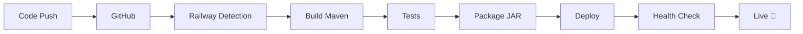

# 📇 Contact Manager - Application de Gestion de Contacts

[](https://web-production-01e1f.up.railway.app/contacts)
[](https://spring.io/projects/spring-boot)
[](https://openjdk.org/)

> Une application web moderne et responsive pour la gestion de contacts avec interface utilisateur élégante, mode sombre et notifications en temps réel.

## 🔗 Application Déployée

**URL de production** : [https://web-production-01e1f.up.railway.app/contacts](https://web-production-01e1f.up.railway.app/contacts)

---

## 📋 Table des Matières

- [Stack Technique](#-stack-technique)
- [Fonctionnalités](#-fonctionnalités)
- [Architecture](#-architecture)
- [Structure du Projet](#-structure-du-projet)
- [Routes et API](#-routes-et-api)
- [Installation et Démarrage](#-installation-et-démarrage)
- [Stratégie de Déploiement](#-stratégie-de-déploiement)
- [Captures d'Écran](#-captures-décran)

---

## 🛠 Stack Technique

### Backend
- **Framework** : Spring Boot 3.5.7
- **Langage** : Java 21
- **ORM** : Spring Data JPA / Hibernate
- **Validation** : Jakarta Bean Validation
- **Template Engine** : Thymeleaf
- **Build Tool** : Maven 3.9+

### Base de Données
- **Développement** : H2 Database (in-memory)
- **Production** : PostgreSQL (Railway)

### Frontend
- **CSS Framework** : Bootstrap 5.3.3
- **Icônes** : Font Awesome 6.5.1
- **JavaScript** : Vanilla JS (ES6+)
- **Styles** : CSS3 avec variables CSS et thème sombre/clair

### Documentation API
- **Swagger/OpenAPI** : SpringDoc OpenAPI 2.6.0
- **Interface Swagger UI** : `/swagger-ui.html`

### Déploiement
- **Platform** : Railway
- **CI/CD** : Déploiement automatique via GitHub
- **Build** : Nixpacks (Java 21)

---

## ✨ Fonctionnalités

### Gestion des Contacts
- ✅ **Création** de contacts avec validation des données
- ✅ **Lecture** et affichage paginé des contacts
- ✅ **Modification** des informations de contact
- ✅ **Suppression douce** (soft delete) des contacts
- ✅ **Recherche** par nom, email ou téléphone
- ✅ **Pagination** (10 contacts par page)

### Interface Utilisateur
- 🎨 **Mode Sombre/Clair** avec sauvegarde de préférence
- 📱 **Design Responsive** (mobile, tablette, desktop)
- 🎯 **Notifications Toast** pour les actions CRUD
- ⚡ **Animations** fluides et transitions CSS
- 🎭 **Gradients** modernes et effets visuels
- 🔔 **Alertes** pour validation et erreurs

### Sécurité et Validation
- 🛡️ **Validation côté serveur** (Jakarta Validation)
- 🔒 **Email unique** avec gestion des doublons
- ⚠️ **Gestion des erreurs** globale
- 📧 **Format email** validé
- 📞 **Format téléphone** marocain (+212...)

### API REST
- 📡 **Endpoints RESTful** complets
- 📚 **Documentation Swagger** interactive
- 🔄 **Support JSON** pour intégrations tierces

---

## 🏗 Architecture

### Architecture en Couches (Layered Architecture)

```
┌─────────────────────────────────────┐
│         Presentation Layer          │
│    (Controllers + Thymeleaf Views)  │
├─────────────────────────────────────┤
│         Service Layer               │
│    (Business Logic + DTOs)          │
├─────────────────────────────────────┤
│         Persistence Layer           │
│    (Repositories + Entities)        │
├─────────────────────────────────────┤
│         Database Layer              │
│    (H2 / PostgreSQL)                │
└─────────────────────────────────────┘
```

### Pattern utilisés

#### 1. **MVC (Model-View-Controller)**
- **Model** : Entities (`Contact.java`) + DTOs
- **View** : Templates Thymeleaf (`list.html`, `form.html`)
- **Controller** : `ContactController.java`

#### 2. **Repository Pattern**
- Abstraction de la couche de persistance
- Interface : `ContactRepository extends JpaRepository`
- Requêtes personnalisées avec `@Query`

#### 3. **DTO Pattern (Data Transfer Object)**
- **ContactRequestDTO** : Validation des entrées
- **ContactResponseDTO** : Sérialisation des sorties
- Séparation des préoccupations

#### 4. **Service Layer Pattern**
- Logique métier centralisée dans `ContactService`
- Encapsulation des opérations CRUD
- Gestion des transactions

#### 5. **Soft Delete Pattern**
- Flag `isDeleted` au lieu de suppression physique
- Préservation des données historiques
- Possibilité de restauration

#### 6. **Exception Handling Pattern**
- `@ControllerAdvice` pour gestion globale
- `GlobalExceptionHandler.java`
- Messages d'erreur personnalisés

---

## 📁 Structure du Projet

```
contact-manager/
├── src/
│   ├── main/
│   │   ├── java/com/seomaniak/contact/
│   │   │   ├── ContactManagerApplication.java      # Point d'entrée + Seed data
│   │   │   ├── controller/
│   │   │   │   ├── ContactController.java          # Contrôleur MVC + REST API
│   │   │   │   └── GlobalExceptionHandler.java    # Gestion d'erreurs
│   │   │   ├── model/
│   │   │   │   ├── entity/
│   │   │   │   │   └── Contact.java                # Entité JPA
│   │   │   │   └── dto/
│   │   │   │       ├── ContactRequestDTO.java      # DTO d'entrée
│   │   │   │       └── ContactResponseDTO.java     # DTO de sortie
│   │   │   ├── repository/
│   │   │   │   └── ContactRepository.java          # Interface JPA Repository
│   │   │   ├── service/
│   │   │   │   └── ContactService.java             # Logique métier
│   │   │   └── exception/
│   │   │       └── ResourceNotFoundException.java  # Exception personnalisée
│   │   └── resources/
│   │       ├── application.yaml                     # Configuration Spring Boot
│   │       ├── static/
│   │       │   └── css/
│   │       │       └── bootstrap.min.css           # Framework CSS
│   │       └── templates/
│   │           ├── contacts/
│   │           │   ├── list.html                   # Page liste contacts
│   │           │   └── form.html                   # Formulaire création/édition
│   │           └── error/
│   │               ├── 404.html                    # Page erreur 404
│   │               └── 500.html                    # Page erreur 500
│   └── test/
│       └── java/com/seomaniak/contact/
│           └── ContactManagerApplicationTests.java
├── .env                                            # Variables d'environnement (local)
├── .env.example                                    # Template variables
├── pom.xml                                         # Dépendances Maven
├── railway.json                                    # Configuration Railway
├── nixpacks.toml                                   # Build configuration
├── Procfile                                        # Process configuration
├── DEPLOYMENT.md                                   # Guide de déploiement
└── README.md                                       # Ce fichier
```

---

## 🛣 Routes et API

### Routes Web (Thymeleaf)

| Méthode | Route | Description |
|---------|-------|-------------|
| `GET` | `/contacts` | Affiche la liste paginée des contacts avec recherche |
| `GET` | `/contacts/new` | Affiche le formulaire de création |
| `GET` | `/contacts/{id}/edit` | Affiche le formulaire d'édition |
| `POST` | `/contacts` | Sauvegarde (création ou mise à jour) d'un contact |
| `POST` | `/contacts/{id}/delete` | Suppression douce d'un contact |

### API REST (JSON)

| Méthode | Route | Description | Réponse |
|---------|-------|-------------|---------|
| `GET` | `/contacts/api` | Liste paginée des contacts | `Page<ContactResponseDTO>` |
| `GET` | `/contacts/api/{id}` | Récupère un contact par ID | `ContactResponseDTO` |

### Documentation API

| Route | Description |
|-------|-------------|
| `/swagger-ui.html` | Interface Swagger UI interactive |
| `/v3/api-docs` | Spécification OpenAPI en JSON |

### Paramètres de Requête

#### Liste et Recherche
- `page` : Numéro de page (défaut: 0)
- `size` : Taille de page (défaut: 10)
- `search` : Terme de recherche (optionnel)

**Exemple** :
```
GET /contacts?page=0&size=10&search=john
```

---

## 🚀 Installation et Démarrage

### Prérequis
- Java 21 ou supérieur
- Maven 3.9+
- Git

### Installation Locale

1. **Cloner le repository**
```bash
git clone https://github.com/Idir0u/contact-manager.git
cd contact-manager
```

2. **Configuration (optionnel)**
```bash
# Copier le fichier d'exemple
cp .env.example .env

# Éditer .env pour H2 (valeurs par défaut)
# Ou configurer PostgreSQL local si nécessaire
```

3. **Build du projet**
```bash
mvn clean package
```

4. **Lancement de l'application**
```bash
# Via Maven
mvn spring-boot:run

# Ou via JAR
java -jar target/contact-manager-0.0.1-SNAPSHOT.jar
```

5. **Accès à l'application**
- **Application** : http://localhost:8081/contacts
- **Swagger UI** : http://localhost:8081/swagger-ui.html
- **Console H2** : http://localhost:8081/h2-console
  - JDBC URL: `jdbc:h2:mem:contactdb`
  - Username: `sa`
  - Password: *(vide)*

### Données de Seed

Au démarrage, l'application insère automatiquement **8 contacts d'exemple** :
- Sarah Dubois
- Mohamed Benali
- Amina El Amrani
- Karim Fassi
- Leila Rahmani
- Youssef Tazi (supprimé)
- Nadia Cherkaoui
- Omar Zaki

---

## 🌐 Stratégie de Déploiement

### Environnements

#### 1. **Développement Local (H2)**
- Base de données : H2 in-memory
- Port : 8081
- Hot reload : Spring Boot DevTools
- Données : Seed automatique

#### 2. **Production (Railway + PostgreSQL)**
- Plateforme : Railway
- Base de données : PostgreSQL managée
- Port : Assigné dynamiquement par Railway
- HTTPS : Automatique
- URL : https://web-production-01e1f.up.railway.app

### Pipeline de Déploiement



### Configuration Railway

#### Fichiers de Configuration
- **`railway.json`** : Configuration de build et déploiement
- **`nixpacks.toml`** : Spécification Java 21
- **`Procfile`** : Commande de démarrage
- **`.railwayignore`** : Fichiers à exclure

#### Variables d'Environnement (Auto-injectées)
```yaml
DATABASE_URL          # Connection PostgreSQL
PORT                  # Port assigné
POSTGRES_USER         # Username DB
POSTGRES_PASSWORD     # Password DB
RAILWAY_ENVIRONMENT   # production
```

#### Processus de Build
```bash
# Build
mvn clean package -DskipTests

# Start
java -jar target/contact-manager-0.0.1-SNAPSHOT.jar
```

### Basculement Automatique H2 ↔ PostgreSQL

L'application détecte automatiquement l'environnement via `application.yaml` :

```yaml
spring:
  datasource:
    url: ${DATABASE_URL:jdbc:h2:mem:contactdb}
    username: ${POSTGRES_USER:sa}
    password: ${POSTGRES_PASSWORD:}
    driver-class-name: ${SPRING_DATASOURCE_DRIVER:org.h2.Driver}
```

- **Local** : Utilise H2 (valeurs par défaut)
- **Railway** : Utilise PostgreSQL (variables injectées)

### Monitoring et Logs

- **Logs Railway** : Accessibles via dashboard Railway
- **Health Check** : Railway vérifie automatiquement l'état
- **Auto-restart** : Redémarrage automatique en cas d'erreur
- **Metrics** : CPU, RAM, Network dans Railway dashboard

---

## 📸 Captures d'Écran

### Interface Principale (Mode Clair)
- Liste paginée avec recherche
- Cards modernes avec effets hover
- Boutons d'action colorés

### Interface Principale (Mode Sombre)
- Thème sombre élégant
- Contraste optimisé
- Sauvegarde de préférence

### Formulaire de Contact (Responsive)
- Design adaptatif mobile/desktop
- Icônes préfixées
- Validation en temps réel

### Notifications Toast
- Succès (vert)
- Erreur (rouge)
- Avertissement (orange)
- Animations fluides

---

## 📊 Modèle de Données

### Entité Contact

```java
@Entity
public class Contact {
    @Id @GeneratedValue
    private Long id;
    
    @NotBlank
    private String firstName;
    
    @NotBlank
    private String lastName;
    
    @Email @NotBlank
    @Column(unique = true)
    private String email;
    
    @Pattern(regexp = "^\\+212[0-9]{9}$")
    private String phone;
    
    private Boolean isDeleted = false;
    
    @CreationTimestamp
    private LocalDateTime createdAt;
    
    @UpdateTimestamp
    private LocalDateTime updatedAt;
}
```

### Contraintes de Validation

- ✅ **Prénom** : Obligatoire, non vide
- ✅ **Nom** : Obligatoire, non vide
- ✅ **Email** : Obligatoire, format valide, unique
- ✅ **Téléphone** : Optionnel, format marocain (+212XXXXXXXXX)

---

## 🔒 Sécurité

### Validations Implémentées
- Validation Jakarta Bean Validation côté serveur
- Contrainte d'unicité sur l'email (base de données)
- Gestion des erreurs de contrainte d'intégrité
- Protection XSS via Thymeleaf escaping

### Bonnes Pratiques
- Soft delete pour préservation des données
- Gestion centralisée des exceptions
- Messages d'erreur utilisateur-friendly
- Séparation DTOs/Entities

---

## 🤝 Contribution

1. Fork le projet
2. Créer une branche feature (`git checkout -b feature/AmazingFeature`)
3. Commit les changements (`git commit -m 'Add some AmazingFeature'`)
4. Push vers la branche (`git push origin feature/AmazingFeature`)
5. Ouvrir une Pull Request

---

## 📝 Licence

Ce projet est un projet éducatif développé par **SEOMANIAK**.

---

## 👨‍💻 Auteur

**SEOMANIAK**
- GitHub: [@Idir0u](https://github.com/Idir0u)
- Application: [Contact Manager](https://web-production-01e1f.up.railway.app/contacts)

---

## 🙏 Remerciements

- Spring Boot Team
- Railway Platform
- Bootstrap & Font Awesome
- Thymeleaf Community

---

**⭐ Si ce projet vous a été utile, n'hésitez pas à lui donner une étoile !**
